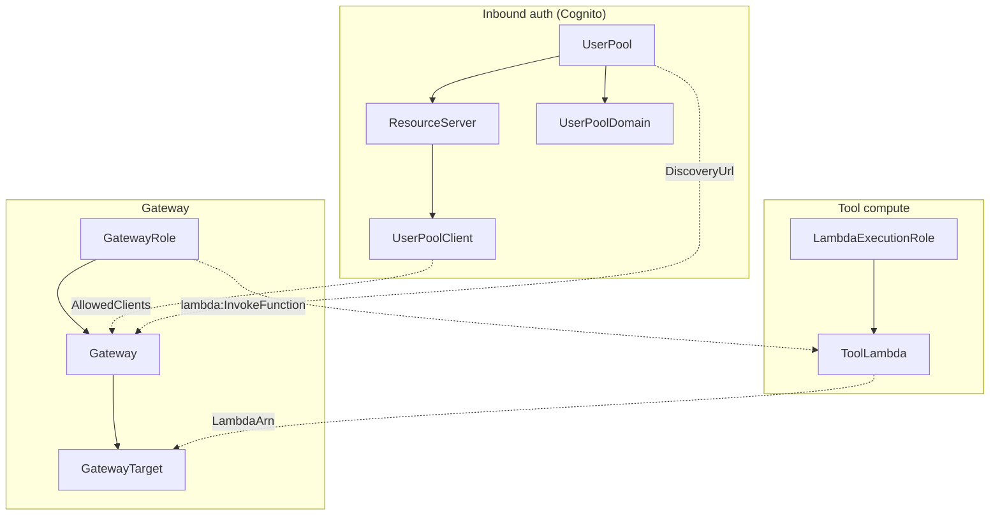

# 5. Deploying the whole harness with CloudFormation

This page explains the **infrastructure-as-code** path: a single CloudFormation
stack that provisions the entire AgentCore harness — the tool Lambda, both IAM
roles, Cognito inbound auth, the gateway, and the Lambda target — in one deploy.
It does the same thing as the step-by-step boto3 scripts in
[`docs/03-deployment-guide.md`](03-deployment-guide.md), but declaratively.

- Template: [`deploy/cloudformation/agentcore-harness.yaml`](../deploy/cloudformation/agentcore-harness.yaml)
- One-command deploy: [`deploy/cloudformation/deploy_stack.sh`](../deploy/cloudformation/deploy_stack.sh)

The full template is reproduced at the [end of this page](#the-full-template).

---

## Why this works: native AgentCore resource types

AgentCore shipped CloudFormation support with its GA, so you can declare the
gateway and its target natively — no custom Lambda-backed resources required:

- **`AWS::BedrockAgentCore::Gateway`** — the managed MCP server + inbound auth.
- **`AWS::BedrockAgentCore::GatewayTarget`** — binds a Lambda (and its tool
  schema) to the gateway.

> If `aws cloudformation deploy` reports an unknown resource type, your region
> doesn't have these types yet — use a supported region (e.g. `us-east-1`) or
> fall back to the boto3 scripts.

---

## What the stack creates

Nine resources, in three groups.



| Logical ID | Type | What it's for |
|---|---|---|
| `LambdaExecutionRole` | `AWS::IAM::Role` | the Lambda's own run-as role (CloudWatch logs) |
| `ToolLambda` | `AWS::Lambda::Function` | the six order-management tools (code from S3) |
| `UserPool` | `AWS::Cognito::UserPool` | the OAuth2 identity provider |
| `ResourceServer` | `AWS::Cognito::UserPoolResourceServer` | declares the `mcp-orders/invoke` scope |
| `UserPoolDomain` | `AWS::Cognito::UserPoolDomain` | hosts the `/oauth2/token` endpoint |
| `UserPoolClient` | `AWS::Cognito::UserPoolClient` | machine-to-machine app client (client-credentials, has a secret) |
| `GatewayRole` | `AWS::IAM::Role` | role the gateway assumes to invoke the Lambda (**outbound auth**) |
| `Gateway` | `AWS::BedrockAgentCore::Gateway` | the MCP endpoint + `CUSTOM_JWT` **inbound auth** |
| `GatewayTarget` | `AWS::BedrockAgentCore::GatewayTarget` | the Lambda + the inline tool schema |

### How the pieces reference each other

CloudFormation figures out creation order from these references (no manual
sequencing needed):

- `Gateway.RoleArn` → `!GetAtt GatewayRole.Arn`
- `Gateway` inbound auth → `AllowedClients: [!Ref UserPoolClient]` and a
  `DiscoveryUrl` built from `!Ref UserPool`
- `GatewayTarget.GatewayIdentifier` → `!GetAtt Gateway.GatewayIdentifier`
- `GatewayTarget` Lambda → `!GetAtt ToolLambda.Arn`
- `GatewayRole` inline policy → `lambda:InvokeFunction` on `!GetAtt ToolLambda.Arn`

---

## The key parts of the template, explained

### Inbound auth (Cognito, client-credentials)

An autonomous agent has no human to log in, so we use the OAuth2
**client-credentials** grant. The app client authenticates *as itself* with a
client id + secret and gets a JWT.

```yaml
UserPoolClient:
  Type: AWS::Cognito::UserPoolClient
  DependsOn: ResourceServer          # scope must exist first
  Properties:
    GenerateSecret: true
    AllowedOAuthFlows: [client_credentials]
    AllowedOAuthFlowsUserPoolClient: true
    AllowedOAuthScopes: [!Sub "${ResourcePrefix}/invoke"]
    SupportedIdentityProviders: [COGNITO]
```

The gateway is told to trust tokens from this pool:

```yaml
AuthorizerType: CUSTOM_JWT
AuthorizerConfiguration:
  CustomJWTAuthorizer:
    AllowedClients: [!Ref UserPoolClient]      # validates the token's client_id claim
    DiscoveryUrl: !Sub "https://cognito-idp.${AWS::Region}.amazonaws.com/${UserPool}/.well-known/openid-configuration"
```

We match on `AllowedClients` (the `client_id` claim) rather than
`AllowedAudience`, because the client-credentials grant does not set an `aud`
claim.

### Outbound auth (the gateway's IAM role)

For Lambda targets the gateway invokes the function using **its own role**
(`GATEWAY_IAM_ROLE`), so that role needs `lambda:InvokeFunction`. The trust
policy also carries an `aws:SourceAccount` **confused-deputy guard** so only
AgentCore acting for *your* account can assume it:

```yaml
GatewayRole:
  Type: AWS::IAM::Role
  Properties:
    AssumeRolePolicyDocument:
      Statement:
        - Effect: Allow
          Principal: { Service: bedrock-agentcore.amazonaws.com }
          Action: sts:AssumeRole
          Condition:
            StringEquals: { aws:SourceAccount: !Ref AWS::AccountId }
    Policies:
      - PolicyName: invoke-tool-lambda
        PolicyDocument:
          Statement:
            - Effect: Allow
              Action: lambda:InvokeFunction
              Resource: !GetAtt ToolLambda.Arn
```

### The target + tool schema

The `GatewayTarget` is where the tool contract lives. `Name: OrderTools`
becomes the **tool-name prefix** the agent sees (`OrderTools___get_order`); the
Lambda strips that prefix (triple underscore) before routing. The
`InlinePayload` is the array of tool definitions:

```yaml
TargetConfiguration:
  Mcp:
    Lambda:
      LambdaArn: !GetAtt ToolLambda.Arn
      ToolSchema:
        InlinePayload:
          - Name: get_order
            Description: Retrieve a single order by its order_id ...
            InputSchema:
              Type: object
              Properties:
                order_id: { Type: string, Description: "e.g. 'O-5001'." }
              Required: [order_id]
          # ... five more tools ...
CredentialProviderConfigurations:
  - CredentialProviderType: GATEWAY_IAM_ROLE
```

> **CloudFormation casing gotcha:** in the CFN schema the JSON-Schema keywords
> are **capitalized** — `Type`, `Properties`, `Required`, `Items`,
> `Description`. That's different from the raw `schemas/tool_schema.json`
> (lowercase `type`/`properties`/...) used by the boto3 path, which passes the
> JSON straight to the API. Same contract, different capitalization convention.

---

## Parameters

| Parameter | Default | Notes |
|---|---|---|
| `ResourcePrefix` | `mcp-orders` | name prefix + Cognito resource-server id / scope namespace |
| `LambdaCodeS3Bucket` | — (required) | existing S3 bucket holding the Lambda zip |
| `LambdaCodeS3Key` | `agentcore/function.zip` | object key of the zip |
| `CognitoDomainPrefix` | — (required) | **globally-unique** hosted-domain prefix |
| `GatewayName` | `OrdersDemoGateway` | gateway name (letters/digits/hyphens) |
| `TargetName` | `OrderTools` | tool-name prefix the agent sees |

**Why the Lambda code comes from S3:** the handler is multi-file
(`handler.py` + `tools.py` + `orders_data.py`), which is too large for
CloudFormation's inline `ZipFile`. So the code is uploaded to S3 first and the
function is created from there — the standard production pattern. `deploy_stack.sh`
does the packaging and upload for you.

---

## Deploy it

One command (packages the Lambda, uploads it, deploys the stack, prints outputs):

```bash
export AWS_REGION=us-east-1
export CODE_BUCKET=my-existing-bucket                    # a bucket you own, in AWS_REGION
export COGNITO_DOMAIN_PREFIX=mcp-orders-123456789012     # must be globally unique
./deploy/cloudformation/deploy_stack.sh
```

By hand:

```bash
# 1. package + upload the Lambda
cd src/lambda && zip -qr /tmp/function.zip . -x '*__pycache__*' && cd -
aws s3 cp /tmp/function.zip s3://my-existing-bucket/agentcore/function.zip

# 2. deploy the stack (IAM roles => CAPABILITY_NAMED_IAM)
aws cloudformation deploy \
  --stack-name agentcore-harness \
  --template-file deploy/cloudformation/agentcore-harness.yaml \
  --capabilities CAPABILITY_NAMED_IAM \
  --parameter-overrides \
    LambdaCodeS3Bucket=my-existing-bucket \
    LambdaCodeS3Key=agentcore/function.zip \
    CognitoDomainPrefix=mcp-orders-123456789012
```

## After deploy: wire up the test client

Every value `client/test_client.py` needs is a stack **Output**, named to match
`deploy/config.sh` — except the Cognito **client secret**, which CloudFormation
doesn't expose. The `ClientSecretRetrievalCommand` output prints the command to
fetch it:

```bash
aws cloudformation describe-stacks --stack-name agentcore-harness \
  --query "Stacks[0].Outputs" --output table

aws cognito-idp describe-user-pool-client \
  --user-pool-id <CognitoUserPoolId output> \
  --client-id  <CognitoClientId output> \
  --query UserPoolClient.ClientSecret --output text
```

Paste the values into `deploy/config.sh`, then:

```bash
source deploy/config.sh
pip install -r client/requirements.txt
python client/test_client.py
```

## Updating & tearing down

- **Tool code changed:** re-run `deploy_stack.sh`. Because CloudFormation only
  refreshes the function when the `Code` property changes, use a
  content-hashed `LambdaCodeS3Key` (or enable bucket versioning) so updates are
  detected reliably.
- **Tool schema changed:** edit the `InlinePayload` in the template and redeploy
  — `GatewayTarget` updates with no interruption.
- **Delete everything:**
  ```bash
  aws cloudformation delete-stack --stack-name agentcore-harness
  aws cloudformation wait stack-delete-complete --stack-name agentcore-harness
  ```

## CloudFormation vs. the boto3 scripts

Both build the identical harness — pick one:

- **CloudFormation** (this page): declarative, one stack, trivial teardown, good
  for repeatable/GitOps deploys. Needs an S3 bucket for the code.
- **boto3 scripts** ([`docs/03`](03-deployment-guide.md)): imperative and
  incremental, nothing to pre-stage, good for learning exactly which API call
  does what.

---

## The full template

Reproduced here for reference; the canonical copy is
[`deploy/cloudformation/agentcore-harness.yaml`](../deploy/cloudformation/agentcore-harness.yaml).

```yaml
AWSTemplateFormatVersion: "2010-09-09"
Description: >-
  AgentCore Gateway harness: a Lambda-backed MCP server exposed through Amazon
  Bedrock AgentCore Gateway, with Cognito (OAuth2 client-credentials) inbound
  auth. Creates the tool Lambda + execution role, the gateway IAM role, a
  Cognito user pool/resource-server/domain/app-client, the gateway, and a
  Lambda target carrying the tool schema. See deploy/cloudformation/README.md.

# ---------------------------------------------------------------------------
# Parameters
# ---------------------------------------------------------------------------
Parameters:
  ResourcePrefix:
    Type: String
    Default: mcp-orders
    Description: Prefix applied to created resource names.
    AllowedPattern: "^[a-z0-9-]{1,30}$"

  LambdaCodeS3Bucket:
    Type: String
    Description: >-
      Name of an existing S3 bucket (in this region) that holds the packaged
      Lambda deployment zip. Upload it with deploy/cloudformation/deploy_stack.sh
      (or `aws s3 cp`) before creating the stack.

  LambdaCodeS3Key:
    Type: String
    Default: agentcore/function.zip
    Description: S3 object key of the packaged Lambda zip.

  CognitoDomainPrefix:
    Type: String
    Description: >-
      Globally-unique prefix for the Cognito hosted domain that serves the
      OAuth2 /oauth2/token endpoint. Must be unique across the region, e.g.
      mcp-orders-<your-account-id>.
    AllowedPattern: "^[a-z0-9-]{3,63}$"

  GatewayName:
    Type: String
    Default: OrdersDemoGateway
    Description: Name of the AgentCore gateway (letters/digits/hyphens only).
    AllowedPattern: "^([0-9a-zA-Z][-]?){1,100}$"

  TargetName:
    Type: String
    Default: OrderTools
    Description: >-
      Gateway target name. This becomes the tool-name prefix the agent sees:
      <TargetName>___<tool>. The Lambda strips this prefix (delimiter is three
      underscores) before routing. Letters/digits/hyphens only.
    AllowedPattern: "^([0-9a-zA-Z][-]?){1,100}$"

# ---------------------------------------------------------------------------
# Resources
# ---------------------------------------------------------------------------
Resources:

  # ==== The tool Lambda ====================================================
  LambdaExecutionRole:
    Type: AWS::IAM::Role
    Properties:
      RoleName: !Sub "${ResourcePrefix}-lambda-role"
      AssumeRolePolicyDocument:
        Version: "2012-10-17"
        Statement:
          - Effect: Allow
            Principal:
              Service: lambda.amazonaws.com
            Action: sts:AssumeRole
      ManagedPolicyArns:
        - arn:aws:iam::aws:policy/service-role/AWSLambdaBasicExecutionRole

  ToolLambda:
    Type: AWS::Lambda::Function
    Properties:
      FunctionName: !Sub "${ResourcePrefix}-tool"
      Runtime: python3.12
      Handler: handler.lambda_handler
      Role: !GetAtt LambdaExecutionRole.Arn
      Timeout: 30
      MemorySize: 256
      Code:
        S3Bucket: !Ref LambdaCodeS3Bucket
        S3Key: !Ref LambdaCodeS3Key

  # ==== Inbound auth: Cognito (OAuth2 client-credentials) ==================
  UserPool:
    Type: AWS::Cognito::UserPool
    Properties:
      UserPoolName: !Sub "${ResourcePrefix}-pool"

  ResourceServer:
    Type: AWS::Cognito::UserPoolResourceServer
    Properties:
      UserPoolId: !Ref UserPool
      # The scope agents request becomes "<Identifier>/<ScopeName>" = "mcp-orders/invoke"
      Identifier: !Ref ResourcePrefix
      Name: !Sub "${ResourcePrefix} resource server"
      Scopes:
        - ScopeName: invoke
          ScopeDescription: Invoke MCP tools through the gateway

  UserPoolDomain:
    Type: AWS::Cognito::UserPoolDomain
    Properties:
      Domain: !Ref CognitoDomainPrefix
      UserPoolId: !Ref UserPool

  # The machine-to-machine app client. Uses client_credentials (no human login);
  # the agent presents this client's id + secret to get a JWT.
  UserPoolClient:
    Type: AWS::Cognito::UserPoolClient
    DependsOn: ResourceServer
    Properties:
      ClientName: !Sub "${ResourcePrefix}-agent-client"
      UserPoolId: !Ref UserPool
      GenerateSecret: true
      AllowedOAuthFlows:
        - client_credentials
      AllowedOAuthFlowsUserPoolClient: true
      AllowedOAuthScopes:
        - !Sub "${ResourcePrefix}/invoke"
      SupportedIdentityProviders:
        - COGNITO

  # ==== Outbound auth: the role the gateway assumes to invoke the Lambda ===
  GatewayRole:
    Type: AWS::IAM::Role
    Properties:
      RoleName: !Sub "${ResourcePrefix}-gateway-role"
      AssumeRolePolicyDocument:
        Version: "2012-10-17"
        Statement:
          - Effect: Allow
            Principal:
              Service: bedrock-agentcore.amazonaws.com
            Action: sts:AssumeRole
            # Confused-deputy guard: only AgentCore acting for THIS account.
            Condition:
              StringEquals:
                aws:SourceAccount: !Ref AWS::AccountId
      Policies:
        - PolicyName: invoke-tool-lambda
          PolicyDocument:
            Version: "2012-10-17"
            Statement:
              - Effect: Allow
                Action: lambda:InvokeFunction
                Resource: !GetAtt ToolLambda.Arn

  # ==== The gateway (managed MCP server) ==================================
  Gateway:
    Type: AWS::BedrockAgentCore::Gateway
    Properties:
      Name: !Ref GatewayName
      RoleArn: !GetAtt GatewayRole.Arn
      ProtocolType: MCP
      AuthorizerType: CUSTOM_JWT
      AuthorizerConfiguration:
        CustomJWTAuthorizer:
          # Match the token's client_id claim (client-credentials sets no aud).
          AllowedClients:
            - !Ref UserPoolClient
          DiscoveryUrl: !Sub "https://cognito-idp.${AWS::Region}.amazonaws.com/${UserPool}/.well-known/openid-configuration"
      Description: Demo gateway exposing an order-management Lambda as MCP tools.

  # ==== The Lambda target (schema + which Lambda backs it) ================
  GatewayTarget:
    Type: AWS::BedrockAgentCore::GatewayTarget
    Properties:
      GatewayIdentifier: !GetAtt Gateway.GatewayIdentifier
      Name: !Ref TargetName
      Description: Order-management Lambda target.
      CredentialProviderConfigurations:
        - CredentialProviderType: GATEWAY_IAM_ROLE
      TargetConfiguration:
        Mcp:
          Lambda:
            LambdaArn: !GetAtt ToolLambda.Arn
            ToolSchema:
              InlinePayload:
                - Name: get_product
                  Description: Look up a single product by its product_id and return its name, category, price and current stock level.
                  InputSchema:
                    Type: object
                    Properties:
                      product_id:
                        Type: string
                        Description: The product identifier, e.g. 'P-1001'.
                    Required:
                      - product_id
                - Name: search_products
                  Description: Search the product catalog by a free-text query matched against product name and category.
                  InputSchema:
                    Type: object
                    Properties:
                      query:
                        Type: string
                        Description: Free-text search term, e.g. 'headphones'.
                      max_results:
                        Type: integer
                        Description: Maximum number of products to return. Defaults to 10 if omitted.
                    Required:
                      - query
                - Name: get_order
                  Description: Retrieve a single order by its order_id, including its status, line items and total.
                  InputSchema:
                    Type: object
                    Properties:
                      order_id:
                        Type: string
                        Description: The order identifier, e.g. 'O-5001'.
                    Required:
                      - order_id
                - Name: list_orders
                  Description: List all orders belonging to a customer, optionally filtered by order status.
                  InputSchema:
                    Type: object
                    Properties:
                      customer_id:
                        Type: string
                        Description: The customer identifier, e.g. 'C-900'.
                      status:
                        Type: string
                        Description: Optional status filter. One of PENDING, SHIPPED, DELIVERED, CANCELLED (case-insensitive).
                    Required:
                      - customer_id
                - Name: create_order
                  Description: Create a new PENDING order for a customer from a list of line items. Validates stock and computes the total.
                  InputSchema:
                    Type: object
                    Properties:
                      customer_id:
                        Type: string
                        Description: The customer the order belongs to, e.g. 'C-900'.
                      items:
                        Type: array
                        Description: The line items to order.
                        Items:
                          Type: object
                          Properties:
                            product_id:
                              Type: string
                              Description: The product to order, e.g. 'P-1001'.
                            quantity:
                              Type: integer
                              Description: How many units to order. Positive integer.
                          Required:
                            - product_id
                            - quantity
                    Required:
                      - customer_id
                      - items
                - Name: cancel_order
                  Description: Cancel an existing order by order_id. Orders already DELIVERED or CANCELLED cannot be cancelled.
                  InputSchema:
                    Type: object
                    Properties:
                      order_id:
                        Type: string
                        Description: The order to cancel, e.g. 'O-5003'.
                      reason:
                        Type: string
                        Description: Optional free-text reason for the cancellation.
                    Required:
                      - order_id

# ---------------------------------------------------------------------------
# Outputs — the values the test client needs. Paste into deploy/config.sh.
# ---------------------------------------------------------------------------
Outputs:
  GatewayMcpUrl:
    Description: The MCP endpoint agents connect to (GATEWAY_MCP_URL).
    Value: !GetAtt Gateway.GatewayUrl

  GatewayId:
    Description: The gateway identifier (GATEWAY_ID).
    Value: !GetAtt Gateway.GatewayIdentifier

  CognitoUserPoolId:
    Description: COGNITO_USER_POOL_ID
    Value: !Ref UserPool

  CognitoClientId:
    Description: COGNITO_CLIENT_ID
    Value: !Ref UserPoolClient

  CognitoDiscoveryUrl:
    Description: COGNITO_DISCOVERY_URL
    Value: !Sub "https://cognito-idp.${AWS::Region}.amazonaws.com/${UserPool}/.well-known/openid-configuration"

  CognitoTokenUrl:
    Description: COGNITO_TOKEN_URL (OAuth2 token endpoint)
    Value: !Sub "https://${CognitoDomainPrefix}.auth.${AWS::Region}.amazoncognito.com/oauth2/token"

  CognitoScope:
    Description: COGNITO_SCOPE
    Value: !Sub "${ResourcePrefix}/invoke"

  ClientSecretRetrievalCommand:
    Description: >-
      The client secret is not exposed as a stack output. Fetch it with this
      command (COGNITO_CLIENT_SECRET).
    Value: !Sub >-
      aws cognito-idp describe-user-pool-client --user-pool-id ${UserPool}
      --client-id ${UserPoolClient} --query UserPoolClient.ClientSecret --output text
```
