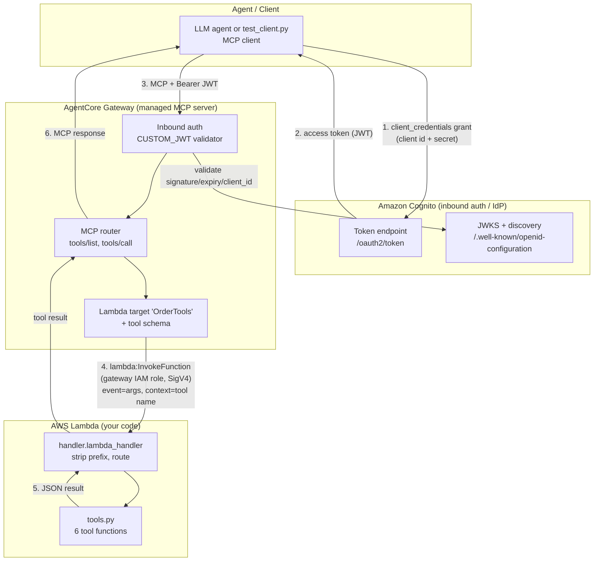

# Architecture

## Components and trust boundaries



## The request lifecycle (one tool call)

1. **Get a token.** The agent presents its client id + secret to Cognito's
   token endpoint (OAuth2 client-credentials grant) and receives a short-lived
   JWT access token.
2. **Open an MCP session.** The agent connects to the gateway's MCP endpoint
   over streamable HTTP, sending `Authorization: Bearer <jwt>`.
3. **Inbound auth.** The gateway validates the JWT against Cognito (signature
   via JWKS from the discovery URL, expiry, and that `client_id` is in
   `allowedClients`). Bad token → `401`/`403`.
4. **Route + invoke.** On `tools/call`, the gateway finds the target that owns
   the tool, then invokes the Lambda using **its own IAM role**
   (`GATEWAY_IAM_ROLE` outbound auth). It passes the arguments as `event` and
   the tool name (prefixed `OrderTools___<tool>`) in
   `context.client_context.custom`.
5. **Execute.** The handler strips the prefix, routes to the matching function
   in `tools.py`, and returns a plain JSON value.
6. **Respond.** The gateway wraps the return value in an MCP tool-result and
   sends it back to the agent.

## Two authorization directions — don't conflate them

```
          INBOUND AUTH                         OUTBOUND AUTH
   "who may call the gateway?"          "how does the gateway call the tool?"
   ─────────────────────────           ───────────────────────────────────
   OAuth2 JWT (Cognito)                 GATEWAY_IAM_ROLE
   authorizerType = CUSTOM_JWT          gateway assumes mcp-orders-gateway-role
   validated on every request           role has lambda:InvokeFunction
```

## What each file maps to in the diagram

| Diagram node | File(s) |
|---|---|
| MCP client | `client/test_client.py` |
| Cognito token endpoint / JWKS | created by `deploy/20_setup_cognito.py` |
| Gateway + inbound auth + target | created by `deploy/30_setup_gateway.py` |
| Tool schema on the target | `schemas/tool_schema.json` |
| Lambda handler (routing) | `src/lambda/handler.py` |
| Tool functions | `src/lambda/tools.py` (+ data in `orders_data.py`) |
| Gateway IAM role / permissions | `deploy/iam/gateway-*.json` |

## Scaling this pattern

- **More tools, same Lambda:** add a tool definition to the schema and a handler
  to `TOOL_REGISTRY`. One function can host a whole domain of related tools.
- **More domains, more Lambdas:** create additional targets on the same gateway,
  each pointing at a different Lambda with its own schema. The agent sees them
  all in one `tools/list`, namespaced by target name.
- **Mixed backends:** a single gateway can combine Lambda targets with OpenAPI,
  Smithy, or existing-MCP-server targets — all behind one endpoint and one auth
  configuration.
